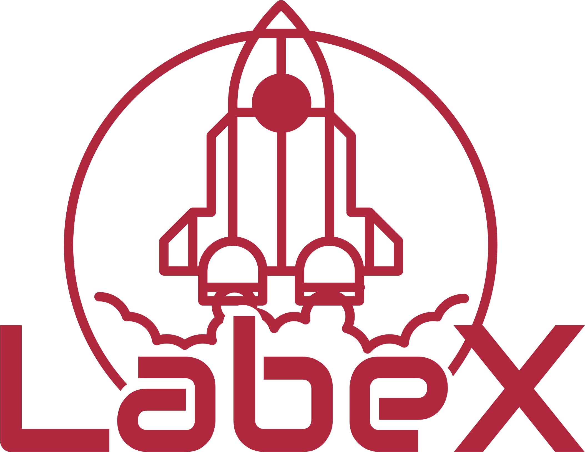

  

  

  <h1>Se candidate a viagens espaciais 🚀</h1>

  <a href="#-sobre-a-aplica%C3%A7%C3%A3o"> Sobre </a> &nbsp;&nbsp;&nbsp;| &nbsp;&nbsp;&nbsp;
  <a href="#-tecnologias">Tecnologias</a> &nbsp;&nbsp;&nbsp;|&nbsp;&nbsp;&nbsp;
  <a href="#-conteúdos-aplicados"> Conteúdos aplicados</a> &nbsp;&nbsp;&nbsp;|&nbsp;&nbsp;&nbsp;
  <a href="#-suporte"> Suporte </a> &nbsp;&nbsp;&nbsp;|&nbsp;&nbsp;&nbsp;
  <a href="#-licen%C3%A7a">Licença</a>

  
  
  
  

 ## 📌 Sobre a aplicação
A **LabeX** é uma aplicação para usuários se candidatarem a viagens espaciais, com uma área para o administrador criar e deletar viagens, e de aprovar ou reprovar candidatos. 

Aplicação construida para fins educacionais, essa foi uma das primeiras aplicações que criei com React.

### 💻 Deploy
O deploy de aplicação pode ser consultado nesse link

## ⚙ Tecnologias
- ReactJS
- HTML5
- CSS3

## 📝 Conteúdos aplicados
- [X] **create-react-app**
- [X] **SPA (Single Page Application)**
- [X] **Componentes em React**
- [X] **Context API**
- [X] **Styled-components**
- [X] **Chackra-UI**

## 🥳 Suporte
Se esse projeto te ajudou de alguma forma, deixe uma ⭐️!

## 📝 Licença

Distribuído sob a licença MIT. Veja `LICENSE` para mais informações.

---
<blockquote>
    Feito por Adryane Cristine Soares Fernandes 🪐
</blockquote>
